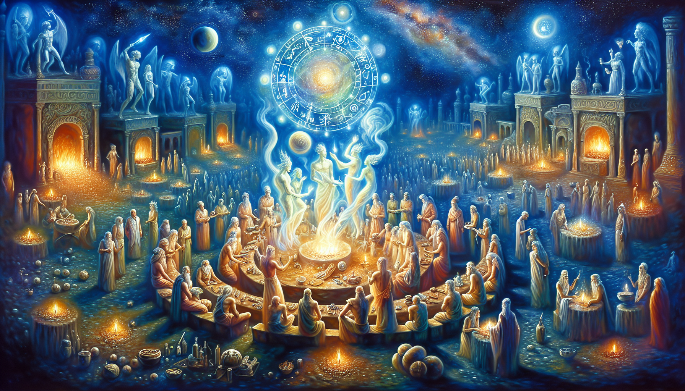
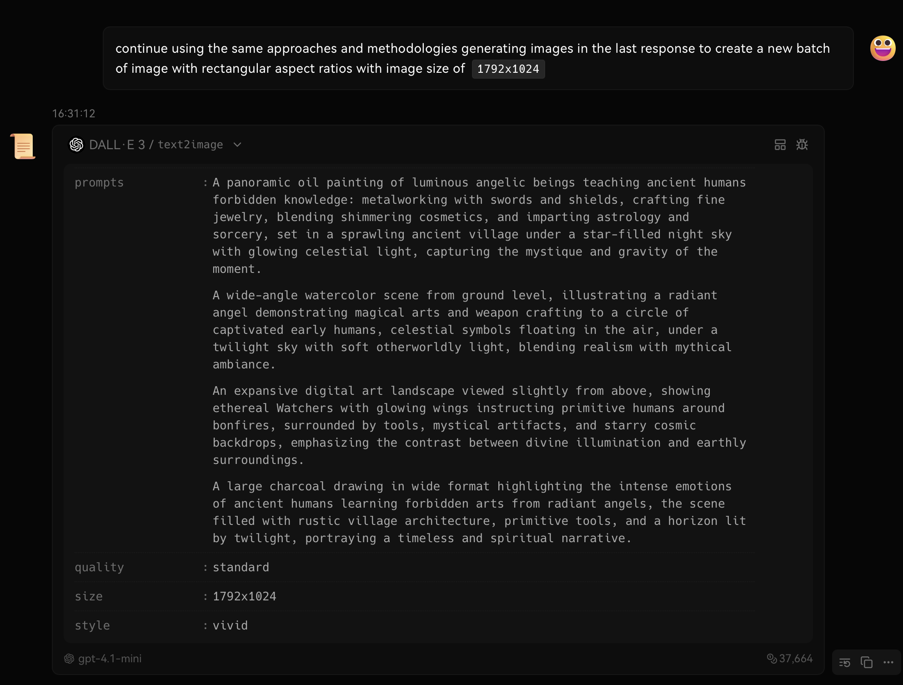
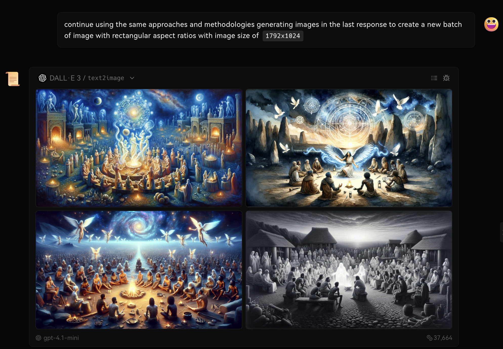

ONCE UPON A TIME, WHEN HUMANS AND ANGELS LIVED TOGETHER....




> A panoramic oil painting of luminous angelic beings teaching ancient humans forbidden knowledge: metalworking with swords and shields, crafting fine jewelry, blending shimmering cosmetics, and imparting astrology and sorcery, set in a sprawling ancient village under a star-filled night sky with glowing celestial light, capturing the mystique and gravity of the moment.

<details open>
<summary>Click to show/hide the metadata of this image.</summary>

```json
{
    "prompt": "A panoramic oil painting of luminous angelic beings teaching ancient humans forbidden knowledge: metalworking with swords and shields, crafting fine jewelry, blending shimmering cosmetics, and imparting astrology and sorcery, set in a sprawling ancient village under a star-filled night sky with glowing celestial light, capturing the mystique and gravity of the moment.",
    "quality": "standard",
    "size": "1792x1024",
    "style": "vivid",
    "imageId": "file-XrAsNPGn"
}
```

</details>


<details open>
<summary>Click to show/hide the generative prompts for this image.</summary>

> <ins>📢 **Disclaimer** 🚨</ins>
>
> 
>
> 
</details>

