```mermaid
---
title: "...⌛...🕰️...CongLeSolutionX...⏳...⌛..."
author: "Cong Le"
version: "1.0"
license(s): "MIT, CC BY-SA 4.0"
copyright: "Copyright (c) 2025 Cong Le. All Rights Reserved."
config:
  theme: base
---
%%%%%%%% Mermaid version v11.4.1-b.14
%%{
  init: {
    'flowchart': { 'htmlLabels': false },
    'fontFamily': 'Luminari',
    'themeVariables': {
      'primaryColor': '#fc82',
      'primaryTextColor': '#F8B229',
      'primaryBorderColor': '#27AE60',
      'secondaryColor': '#5229',
      'secondaryTextColor': '#6C3483',
      'lineColor': '#F8B229',
      'fontSize': '25px'
    }
  }
}%%
flowchart LR
     %% My_Meme@{ img: "https://raw.githubusercontent.com/CongLeSolutionX/CongLeSolutionX/refs/heads/main/assets/images/My-meme-and-question-marks-open-book-old-characters-background.png", label: "..🙉..👀..📖..", pos: "b", w: 200, h: 150, constraint: "off" }
   
  %% Opening_quote@{ shape: comment, label: "..👀..<br/>...ONCE UPON A TIME,<br/>WHEN HUMANS AND ANGELS LIVED TOGETHER...<br/>..👀.."}

Opening_quote@{ shape: docs, label: "..👀.....ONCE UPON A TIME,<br/>WHEN HUMANS AND ANGELS LIVED TOGETHER...👀.."}

```

<!--
Let's make this gray area a matter of gray, shall we?


## Revised Inquiries on Authorship and IP for Multi-Stage, AI-Driven Creative Works

**Preamble & Context:**

I am developing a creative workflow that transforms public domain source material into a new, illustrated format (e.g., a comic book). My process is highly structured and involves a specific chain of AI models, each performing a distinct task under my direction:

1.  **Source Material:** An ancient text (public domain) is selected as the narrative foundation.
2.  **Translation & Simplification:** I instruct a Large Language Model (**Gemini**) to translate the ancient text into simplified, modern English.
3.  **Prompt Engineering:** I then instruct a second LLM (**GPT-4.1-mini**) to interpret the simplified English narrative and generate a series of detailed, descriptive prompts suitable for an image generation model.
4.  **Image Generation:** These specific prompts are executed by an image model (**DALL-E 3**) to create the final visual assets.
5.  **Final Assembly:** The generated images are organized into a complete work.

My contribution is the design, direction, and orchestration of this entire multi-stage pipeline. With this workflow established, I have the following legal and ethical questions regarding intellectual property:

**Part 1: Authorship and Copyright of the Final Work and Its Components**

1.  **Copyright in a Derivative Work:** Since the final comic book is a new, transformative adaptation of a public domain text, can I claim authorship and copyright over this new derivative work in its entirety, even if the constituent images are AI-generated?
2.  **Authorship of Individual Images:** Can I be considered the legal author of the individual images, given they are the end product of a specific, multi-step process I designed and directed, originating from my initial instructions?
3.  **Permissible Attribution:** If direct copyright is not granted under current law, what is the most accurate and legally sound way to credit my role? For example, would titles like "Creative Director," "Process Designer," or "Adaptation by" be appropriate?

**Part 2: Intellectual Property of the Creative Methodology and Prompts**

1.  **Protecting the Workflow as IP:** My defined methodology (the specific sequence of models, instructions, and parameters) consistently transforms a given source text into a predictable visual output. Can this entire creative *process* be considered a form of protectable intellectual property, such as a trade secret or a set of proprietary instructions?
2.  **Licensing the Process and Its Textual Artifacts:** If the methodology is protectable, could it be licensed? Furthermore, can the textual outputs from the intermediate steps (i.e., the simplified English from Gemini and the final prompts from GPT-4) be licensed under frameworks like the **MIT License** (as functional components) or **Creative Commons** (as literary works)?
3.  **Impact of System-Dependency:** The success and repeatability of this workflow are contingent on the specific models and versions used. Does this dependency on third-party systems affect the legal status or practical value of the methodology as licensable IP?

-->


----

> <ins>📢 **Disclaimer** 🚨</ins>
>
> This project is born from my fascination with blending digital art and artificial intelligence.</br>
> It's where I document my academic explorations,</br>
> share my findings with anyone interested,</br>
> and maintain a personal vault of my creative and technical journey.</br>
> I'm not sure the link for this repo being shared in the back by others,</br>
> since I haven't planned for any analytics for this project yet.</br>
> Any user who shares, adapts, or builds upon this work is responsible for their own interpretations and applications.

> ...and I'm actively looking for a job...</br>

> This document contains my personal notes on the topic,</br>
> compiled from publicly available documentation and various cited sources.
> 
> The materials are intended for educational purposes (<ins>sometimes, entertainment purposes</ins>), personal study, and technical reference.
> The content is dual-licensed:
> 1. **MIT License:** Applies to all code implementations (Swift, Mermaid, and other programming languages).
> 2. **Creative Commons Attribution-ShareAlike 4.0 International License (CC BY-SA 4.0):** Applies to all non-code content, including text, explanations, diagrams, and illustrations.

----


<div align="center">



</div>

----
<div align="center">
  <blockquote>
    Hark,<br/>
    for the veil lifts upon another vision,<br/>
    inscribed in the style of ages past:
  </blockquote>
</div>


> A panoramic oil painting of luminous angelic beings teaching ancient humans forbidden knowledge: metalworking with swords and shields, crafting fine jewelry, blending shimmering cosmetics, and imparting astrology and sorcery, set in a sprawling ancient village under a star-filled night sky with glowing celestial light, capturing the mystique and gravity of the moment.

<details open>
<summary>Unveil the script of this vision's genesis.</summary>

```json
{
    "prompt": "A panoramic oil painting of luminous angelic beings teaching ancient humans forbidden knowledge: metalworking with swords and shields, crafting fine jewelry, blending shimmering cosmetics, and imparting astrology and sorcery, set in a sprawling ancient village under a star-filled night sky with glowing celestial light, capturing the mystique and gravity of the moment.",
    "quality": "standard",
    "size": "1792x1024",
    "style": "vivid",
    "imageId": "file-XrAsNPGn"
}
```

</details>


<details open>
<summary>Peer into the ceaseless loom of ♾️ <b>Creation's Unending Tapestry</b> ♻️.</summary>

> <ins>📜♾️♻️ **The Unbroken Chain of Creation's Forge** 🛠️🔥🔗🌌🔮🌟</ins>
>
> 
>
> 
</details>

----

## 📜 Chronicles of the Sacred Scrolls: Recent Whispers and Deeds

<div align="center">
	
	<br/>
	<blockquote>gif image is provided by <a href="https://giphy.com">Giphy</a></blockquote>
</div>


<div align="left"><a name="project-current-activities"></a>

<details open>
<summary>Unfurl the scrolls to witness the latest tidings from this hallowed endeavor</summary>

> powered by the mystical fonts of [OSS Insight](https://ossinsight.io)
<!-- All the diagrams below are woven with enchantments from [OSS Insight](https://ossinsight.io/) -->

| :bar_chart: Tablet of Ancient Records & Its Augury | :art: Visions in the Crystal Orb (Light Mode) |
|---|---|
| Keepers of the Lore :scroll::mage: from CongLeSolutionX/The-Book-of-Enoch - Within the Last Moon's Cycle (28 days) |  <br/> :link: [Gaze Deeper into the Full Augury :mag:](https://next.ossinsight.io/widgets/official/compose-recent-active-contributors?repo_id=1006266693&limit=30) |
| New Verses Inscribed :arrow_up: and Chapters Penned :writing_hand: within CongLeSolutionX/The-Book-of-Enoch |  <br/> :link: [Gaze Deeper into the Full Augury :mag:](https://next.ossinsight.io/widgets/official/analyze-repo-pushes-and-commits-per-month?repo_id=1006266693) |
| The Measure of Added Wisdom :straight_ruler: to CongLeSolutionX/The-Book-of-Enoch |  <br/> :link: [Gaze Deeper into the Full Augury :mag:](https://next.ossinsight.io/widgets/official/analyze-repo-pull-requests-size-per-month?repo_id=1006266693) |
| The Journey of New Teachings :arrows_counterclockwise: in CongLeSolutionX/The-Book-of-Enoch |  <br/> :link: [Gaze Deeper into the Full Augury :mag:](https://next.ossinsight.io/widgets/official/analyze-repo-pull-request-open-to-merged?repo_id=1006266693) |
| Glyphs and Runes Transformed :computer::scroll: within CongLeSolutionX/The-Book-of-Enoch |  <br/> :link: [Gaze Deeper into the Full Augury :mag:](https://next.ossinsight.io/widgets/official/analyze-repo-loc-per-month?repo_id=1006266693) |
| The Scribes' Hours of Dedication :alarm_clock::date: to CongLeSolutionX/The-Book-of-Enoch |  <br/> :link: [Gaze Deeper into the Full Augury :mag:](https://next.ossinsight.io/widgets/official/analyze-repo-commits-time-distribution?repo_id=1006266693&period=last_1_year&zone=0) | 

</details>

</div>

---

<div align="center">
	
	<br/>
	<blockquote>gif image is provided by <a href="https://giphy.com">Giphy</a></blockquote>
</div>


----

<div align="center">

<!-- 
```mermaid
%% Current Mermaid version
info
``` 
-->


```mermaid
---
author: "Cong Le"
version: "1.0"
license(s): "MIT, CC BY-SA 4.0"
copyright: "Copyright (c) 2025 Cong Le. All Rights Reserved."
config:
  theme: base
---
%%%%%%%% Mermaid version v11.4.1-b.14
%%{
  init: {
    'flowchart': { 'htmlLabels': false },
    'fontFamily': 'Luminari',
    'themeVariables': {
      'primaryColor': '#fc82',
      'primaryTextColor': '#F8B229',
      'primaryBorderColor': '#27AE60',
      'secondaryColor': '#5229',
      'secondaryTextColor': '#6C3483',
      'lineColor': '#F8B229',
      'fontSize': '25px'
    }
  }
}%%
flowchart LR
My_Meme@{ img: "https://raw.githubusercontent.com/CongLeSolutionX/CongLeSolutionX/refs/heads/main/assets/images/My-meme-and-question-marks-open-book-old-characters-background.png", label: "❓...C<char>o#770;</char>ngL<char>e#770;</char>SolutionX...❓", pos: "b", w: 200, h: 150, constraint: "off" }
   
%% Opening_quote@{ shape: braces, label: "..👀..<br/>...ONCE UPON A TIME,<br/>WHEN HUMANS AND ANGELS LIVED TOGETHER...<br/>..👀.."}

%% Opening_quote@{ shape: bolt, label: "..👀.....ONCE UPON A TIME,<br/>WHEN HUMANS AND ANGELS LIVED TOGETHER...👀.."}


```

</div>

-----
