```mermaid
---
title: "❓...CongLeSolutionX....❓"
author: "Cong Le"
version: "1.0"
license(s): "MIT, CC BY-SA 4.0"
copyright: "Copyright (c) 2025 Cong Le. All Rights Reserved."
config:
  theme: base
---
%%%%%%%% Mermaid version v11.4.1-b.14
%%{
  init: {
    'flowchart': { 'htmlLabels': false },
    'fontFamily': 'Luminari',
    'themeVariables': {
      'primaryColor': '#fc82',
      'primaryTextColor': '#F8B229',
      'primaryBorderColor': '#27AE60',
      'secondaryColor': '#5229',
      'secondaryTextColor': '#6C3483',
      'lineColor': '#F8B229',
      'fontSize': '25px'
    }
  }
}%%
flowchart LR
     %% My_Meme@{ img: "https://raw.githubusercontent.com/CongLeSolutionX/CongLeSolutionX/refs/heads/main/assets/images/My-meme-and-question-marks-open-book-old-characters-background.png", label: "..🙉..👀..📖..", pos: "b", w: 200, h: 150, constraint: "off" }
   
  %% Opening_quote@{ shape: comment, label: "..👀..<br/>...ONCE UPON A TIME,<br/>WHEN HUMANS AND ANGELS LIVED TOGETHER...<br/>..👀.."}

Opening_quote@{ shape: docs, label: "..👀.....ONCE UPON A TIME,<br/>WHEN HUMANS AND ANGELS LIVED TOGETHER...👀.."}

```

----



----


> A panoramic oil painting of luminous angelic beings teaching ancient humans forbidden knowledge: metalworking with swords and shields, crafting fine jewelry, blending shimmering cosmetics, and imparting astrology and sorcery, set in a sprawling ancient village under a star-filled night sky with glowing celestial light, capturing the mystique and gravity of the moment.

<details open>
<summary>Click to show/hide the metadata of this image.</summary>

```json
{
    "prompt": "A panoramic oil painting of luminous angelic beings teaching ancient humans forbidden knowledge: metalworking with swords and shields, crafting fine jewelry, blending shimmering cosmetics, and imparting astrology and sorcery, set in a sprawling ancient village under a star-filled night sky with glowing celestial light, capturing the mystique and gravity of the moment.",
    "quality": "standard",
    "size": "1792x1024",
    "style": "vivid",
    "imageId": "file-XrAsNPGn"
}
```

</details>


<details open>
<summary>Click to show/hide the generative prompts for this image.</summary>

> <ins>📢 **Disclaimer** 🚨</ins>
>
> 
>
> 
</details>


```mermaid
---
title: "❓...CongLeSolutionX....❓"
author: "Cong Le"
version: "1.0"
license(s): "MIT, CC BY-SA 4.0"
copyright: "Copyright (c) 2025 Cong Le. All Rights Reserved."
config:
  theme: base
---
%%%%%%%% Mermaid version v11.4.1-b.14
%%{
  init: {
    'flowchart': { 'htmlLabels': false },
    'fontFamily': 'Luminari',
    'themeVariables': {
      'primaryColor': '#fc82',
      'primaryTextColor': '#F8B229',
      'primaryBorderColor': '#27AE60',
      'secondaryColor': '#5229',
      'secondaryTextColor': '#6C3483',
      'lineColor': '#F8B229',
      'fontSize': '25px'
    }
  }
}%%
flowchart LR
     My_Meme@{ img: "https://raw.githubusercontent.com/CongLeSolutionX/CongLeSolutionX/refs/heads/main/assets/images/My-meme-and-question-marks-open-book-old-characters-background.png", label: "..🙉..👀..📖..", pos: "b", w: 200, h: 150, constraint: "off" }
   
  %% Opening_quote@{ shape: braces, label: "..👀..<br/>...ONCE UPON A TIME,<br/>WHEN HUMANS AND ANGELS LIVED TOGETHER...<br/>..👀.."}

Opening_quote@{ shape: bolt, label: "..👀.....ONCE UPON A TIME,<br/>WHEN HUMANS AND ANGELS LIVED TOGETHER...👀.."}


```


