```mermaid
---
title: "...⌛...🕰️.....⏳...⌛..."
author: N/A
version: N/A
license(s): N/A
copyright: N/A
config:
  theme: base
---
%%%%%%%% Mermaid version v11.4.1-b.14
%%{
  init: {
    'flowchart': { 'htmlLabels': false },
    'fontFamily': 'Luminari',
    'themeVariables': {
      'primaryColor': '#fc82',
      'primaryTextColor': '#F8B229',
      'primaryBorderColor': '#27AE60',
      'secondaryColor': '#5229',
      'secondaryTextColor': '#6C3483',
      'lineColor': '#F8B229',
      'fontSize': '25px'
    }
  }
}%%
flowchart LR
     %% My_image@{ img: "https://raw.githubusercontent.com/CongLeSolutionX/CongLeSolutionX/refs/heads/main/assets/images/My-meme-and-question-marks-open-book-old-characters-background.png", label: "..🙉..👀..📖..", pos: "b", w: 200, h: 150, constraint: "off" }
   
  %% Opening_quote@{ shape: comment, label: "..👀..<br/>...ONCE UPON A TIME,<br/>WHEN HUMANS AND ANGELS LIVED TOGETHER...<br/>..👀.."}

Opening_quote@{ shape: docs, label: "..👀.....ONCE UPON A TIME,<br/>WHEN HUMANS AND ANGELS LIVED TOGETHER...👀.."}

```

<blockquote>
<b>Subject: Seeking Guidance on Authorship and IP in a Collaborative AI Creative Process</b>

**A little background on my project:**

I'm exploring a new creative process that uses a chain of AI tools to transform public domain stories into new, illustrated formats like comic books. My goal is to understand the best way to approach the legal and ethical questions that arise, so I can move forward responsibly.

Here’s a brief look at the steps I'm taking, with my role being to guide the process from start to finish:

1.  **Source Material:** I start with an ancient text from the public domain.
2.  **Simplifying the Narrative:** I work with a language model (**Gemini**) to translate and simplify the text into modern English, directing its output.
3.  **Crafting Image Prompts:** I then guide another language model (**GPT-4.1-mini**) to turn the simplified story into a series of detailed, descriptive prompts for an image generator.
4.  **Generating Illustrations:** Those specific prompts are then used with an image model (**DALL-E 3**) to create the visual artwork.
5.  **Final Assembly:** Finally, I collect and arrange the generated images to create the finished comic book.

My contribution is in designing this entire pipeline, making the creative choices at each stage, and assembling the final product. With that in mind, I have a few questions about how intellectual property might apply here.

**Part 1: Understanding Authorship and Copyright**

1.  **The Finished Work:** The final comic book is a new adaptation of a public domain story. I'm wondering what the current thinking is on whether a creator can hold the copyright for this kind of derivative work, especially when it's the result of significant human direction and curation.
2.  **The Individual Images:** For the images themselves, how is authorship usually viewed? I'm curious if the level of human involvement in designing the multi-step process that leads to a specific image has any bearing on an authorship claim.
3.  **Crediting My Role:** If I can't claim direct copyright under today's rules, what would be the most honest and appropriate way to credit my contribution? I've been thinking about titles like "Creative Director," "Process Designer," or "Adaptation by." Are these suitable?

**Part 2: The Creative Process and Its Outputs**

1.  **The Workflow Itself:** The method I've designed—the specific sequence of models, instructions, and creative choices—is repeatable. Is a creative *process* like this something that could be considered intellectual property, maybe in the way a trade secret is?
2.  **Licensing the Process & Text:** If the process is protectable, could it be licensed to others? Separately, what about the text created along the way (the simplified story from Gemini or the prompts from GPT-4)? I'm wondering if those could be shared under open licenses like Creative Commons or MIT.
3.  **Dependence on Third-Party Tools:** My workflow relies on the specific AI models available today. How does this dependence on external systems typically affect the value or legal standing of a creative process as a form of IP?

Thank you for any insights you can offer. I'm excited about the creative possibilities but want to be sure I'm navigating this new landscape thoughtfully.

---

</blockquote>

---


<div align="center">



</div>

----
<div align="center">
  <blockquote>
    look at this next piece,<br/>
	presented in a vintage format.
  </blockquote>
</div>


> A panoramic oil painting of luminous angelic beings teaching ancient humans forbidden knowledge: metalworking with swords and shields, crafting fine jewelry, blending shimmering cosmetics, and imparting astrology and sorcery, set in a sprawling ancient village under a star-filled night sky with glowing celestial light, capturing the mystique and gravity of the moment.

<details open>
<summary>Unveil the script of this vision's genesis.</summary>

```json
{
    "prompt": "A panoramic oil painting of luminous angelic beings teaching ancient humans forbidden knowledge: metalworking with swords and shields, crafting fine jewelry, blending shimmering cosmetics, and imparting astrology and sorcery, set in a sprawling ancient village under a star-filled night sky with glowing celestial light, capturing the mystique and gravity of the moment.",
    "quality": "standard",
    "size": "1792x1024",
    "style": "vivid",
    "imageId": "file-XrAsNPGn"
}
```

</details>


---


----


<div align="center">
  <blockquote>
  As a visual learner student, I created these personal study notes from the cited source(s) to aid my understanding.<br/>
  While my firm intention is to provide full credit, the blended format of notes and diagrams may sometimes obscure the original source, for which I apologize.<br/>
  I am committed to making corrections and welcome any feedback.<br/>
  This is a non-commercial project for my humble educational purposes only since the start.<br/>
  My goal is to share my perspective and contribute to the great work already being done.
  <br/>
  <br/>
  I want to extend my genuine apologies to the creators of the original material.<br/>
  Their work was the direct inspiration for this project, and I adapted it without first reaching out.<br/>
  My intent comes from a place of deep respect, and I hope this is received in the spirit of homage.<br/>
  🙏🏼🙏🏼🙏🏼🙏🏼
  </blockquote>
</div>


-----
