```mermaid
---
title: "...⌛...🕰️...C<char>o&#770;</char>ngL<char>e&#770;</char>SolutionX...⏳...⌛..."
author: "Cong Le"
version: "1.0"
license(s): "MIT, CC BY-SA 4.0"
copyright: "Copyright (c) 2025 Cong Le. All Rights Reserved."
config:
  theme: base
---
%%%%%%%% Mermaid version v11.4.1-b.14
%%{
  init: {
    'flowchart': { 'htmlLabels': false },
    'fontFamily': 'Luminari',
    'themeVariables': {
      'primaryColor': '#fc82',
      'primaryTextColor': '#F8B229',
      'primaryBorderColor': '#27AE60',
      'secondaryColor': '#5229',
      'secondaryTextColor': '#6C3483',
      'lineColor': '#F8B229',
      'fontSize': '25px'
    }
  }
}%%
flowchart LR
     %% My_Meme@{ img: "https://raw.githubusercontent.com/CongLeSolutionX/CongLeSolutionX/refs/heads/main/assets/images/My-meme-and-question-marks-open-book-old-characters-background.png", label: "..🙉..👀..📖..", pos: "b", w: 200, h: 150, constraint: "off" }
   
  %% Opening_quote@{ shape: comment, label: "..👀..<br/>...ONCE UPON A TIME,<br/>WHEN HUMANS AND ANGELS LIVED TOGETHER...<br/>..👀.."}

Opening_quote@{ shape: docs, label: "..👀.....ONCE UPON A TIME,<br/>WHEN HUMANS AND ANGELS LIVED TOGETHER...👀.."}

```

<!--
Let's make this gray area a matter of gray, shall we?


## Revised Inquiries on Authorship and IP for Multi-Stage, AI-Driven Creative Works

**Preamble & Context:**

I am developing a creative workflow that transforms public domain source material into a new, illustrated format (e.g., a comic book). My process is highly structured and involves a specific chain of AI models, each performing a distinct task under my direction:

1.  **Source Material:** An ancient text (public domain) is selected as the narrative foundation.
2.  **Translation & Simplification:** I instruct a Large Language Model (**Gemini**) to translate the ancient text into simplified, modern English.
3.  **Prompt Engineering:** I then instruct a second LLM (**GPT-4.1-mini**) to interpret the simplified English narrative and generate a series of detailed, descriptive prompts suitable for an image generation model.
4.  **Image Generation:** These specific prompts are executed by an image model (**DALL-E 3**) to create the final visual assets.
5.  **Final Assembly:** The generated images are organized into a complete work.

My contribution is the design, direction, and orchestration of this entire multi-stage pipeline. With this workflow established, I have the following legal and ethical questions regarding intellectual property:

**Part 1: Authorship and Copyright of the Final Work and Its Components**

1.  **Copyright in a Derivative Work:** Since the final comic book is a new, transformative adaptation of a public domain text, can I claim authorship and copyright over this new derivative work in its entirety, even if the constituent images are AI-generated?
2.  **Authorship of Individual Images:** Can I be considered the legal author of the individual images, given they are the end product of a specific, multi-step process I designed and directed, originating from my initial instructions?
3.  **Permissible Attribution:** If direct copyright is not granted under current law, what is the most accurate and legally sound way to credit my role? For example, would titles like "Creative Director," "Process Designer," or "Adaptation by" be appropriate?

**Part 2: Intellectual Property of the Creative Methodology and Prompts**

1.  **Protecting the Workflow as IP:** My defined methodology (the specific sequence of models, instructions, and parameters) consistently transforms a given source text into a predictable visual output. Can this entire creative *process* be considered a form of protectable intellectual property, such as a trade secret or a set of proprietary instructions?
2.  **Licensing the Process and Its Textual Artifacts:** If the methodology is protectable, could it be licensed? Furthermore, can the textual outputs from the intermediate steps (i.e., the simplified English from Gemini and the final prompts from GPT-4) be licensed under frameworks like the **MIT License** (as functional components) or **Creative Commons** (as literary works)?
3.  **Impact of System-Dependency:** The success and repeatability of this workflow are contingent on the specific models and versions used. Does this dependency on third-party systems affect the legal status or practical value of the methodology as licensable IP?

-->


----


<div align="center">
  <blockquote>
  As a visual learner student, I created these personal study notes from the cited source(s) to aid my understanding.<br/>
  While my firm intention is to provide full credit, the blended format of notes and diagrams may sometimes obscure the original source, for which I apologize.<br/>
  I am committed to making corrections and welcome any feedback.<br/>
  This is a non-commercial project for my humble educational purposes only since the start.<br/>
  My goal is to share my perspective and contribute to the great work already being done.
  <br/>
  <br/>
  I want to extend my genuine apologies to the creators of the original material.<br/>
  Their work was the direct inspiration for this project, and I adapted it without first reaching out.<br/>
  My intent comes from a place of deep respect, and I hope this is received in the spirit of homage.<br/>
  🙏🏼🙏🏼🙏🏼🙏🏼
  </blockquote>
</div>

----


<div align="center">



</div>

----
<div align="center">
  <blockquote>
    Hark,<br/>
    for the veil lifts upon another vision,<br/>
    inscribed in the style of ages past:
  </blockquote>
</div>


> A panoramic oil painting of luminous angelic beings teaching ancient humans forbidden knowledge: metalworking with swords and shields, crafting fine jewelry, blending shimmering cosmetics, and imparting astrology and sorcery, set in a sprawling ancient village under a star-filled night sky with glowing celestial light, capturing the mystique and gravity of the moment.

<details open>
<summary>Unveil the script of this vision's genesis.</summary>

```json
{
    "prompt": "A panoramic oil painting of luminous angelic beings teaching ancient humans forbidden knowledge: metalworking with swords and shields, crafting fine jewelry, blending shimmering cosmetics, and imparting astrology and sorcery, set in a sprawling ancient village under a star-filled night sky with glowing celestial light, capturing the mystique and gravity of the moment.",
    "quality": "standard",
    "size": "1792x1024",
    "style": "vivid",
    "imageId": "file-XrAsNPGn"
}
```

</details>


---

<div align="center">
	
	<br/>
	<blockquote>gif image is provided by <a href="https://giphy.com">Giphy</a></blockquote>
</div>


-----
