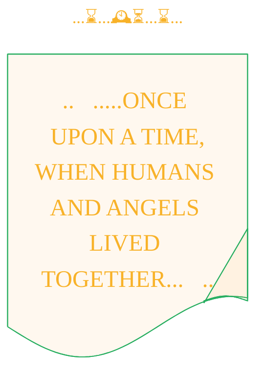

> ⚠️🏗️🚧🦺🧱🪵🪨🪚🛠️👷
> 
> This is a working draft in progress
> 
> ⚠️🏗️🚧🦺🧱🪵🪨🪚🛠️👷


----


# The Ethiopic Version of the Book of Enoch

---

<div align="center">
  <blockquote>
  As a visual learner student, I created these personal study notes from the cited source(s) to aid my understanding.<br/>
  While my firm intention is to provide full credit, the blended format of notes and diagrams may sometimes obscure the original source, for which I apologize.<br/>
  I am committed to making corrections and welcome any feedback.<br/>
  This is a non-commercial project for my humble educational purposes only since the start.<br/>
  My goal is to share my perspective and contribute to the great work already being done.
  <br/>
  <br/>
  I want to extend my genuine apologies to the creators of the original material.<br/>
  Their work was the direct inspiration for this project, and I adapted it without first reaching out.<br/>
  My intent comes from a place of deep respect, and I hope this is received in the spirit of homage.<br/>
  🙏🏼🙏🏼🙏🏼🙏🏼
  </blockquote>
</div>

----



```mermaid
---
title: "...⌛...🕰️⏳...⌛..."
author: NA
version: NA
license(s): NA
copyright: NA
config:
  theme: base
---
%%%%%%%% Mermaid version v11.4.1-b.14
%%{
  init: {
    'flowchart': { 'htmlLabels': false },
    'fontFamily': 'Bradley Hand',
    'themeVariables': {
      'primaryColor': '#fc82',
      'primaryTextColor': '#F8B229',
      'primaryBorderColor': '#27AE60',
      'secondaryColor': '#5229',
      'secondaryTextColor': '#6C3483',
      'lineColor': '#F8B229',
      'fontSize': '25px'
    }
  }
}%%
flowchart LR
     %% My_Meme@{ img: "https://raw.githubusercontent.com/CongLeSolutionX/CongLeSolutionX/refs/heads/main/assets/images/My-meme-and-question-marks-open-book-old-characters-background.png", label: "..🙉..👀..📖..", pos: "b", w: 200, h: 150, constraint: "off" }
   
  %% Opening_quote@{ shape: comment, label: "..👀..<br/>...ONCE UPON A TIME,<br/>WHEN HUMANS AND ANGELS LIVED TOGETHER...<br/>..👀.."}

Opening_quote@{ shape: tag-doc, label: "..👀.....ONCE UPON A TIME,<br/>WHEN HUMANS AND ANGELS LIVED TOGETHER...👀.."}

```


> An expansive digital art landscape viewed slightly from above, showing ethereal Watchers with glowing wings instructing primitive humans around bonfires, surrounded by tools, mystical artifacts, and starry cosmic backdrops, emphasizing the contrast between divine illumination and earthly surroundings.


<details open>
<summary>Click to show/hide the metadata of this image.</summary>

```json
{
    "prompt": "An expansive digital art landscape viewed slightly from above, showing ethereal Watchers with glowing wings instructing primitive humans around bonfires, surrounded by tools, mystical artifacts, and starry cosmic backdrops, emphasizing the contrast between divine illumination and earthly surroundings.",
    "quality": "standard",
    "size": "1792x1024",
    "style": "vivid",
    "imageId": "file-GA733xcE"
  }
  
```

</details>


<details open>
<summary>Click to show/hide the ♾️ <b>Continuous Production</b> ♻️.</summary>

> <ins>🏭♾️♻️ **Continuous Production** 🏗️ ⚒️⛓️⚔️⚙️🚧🚨</ins>
>
> 
>
> 
</details>


---
